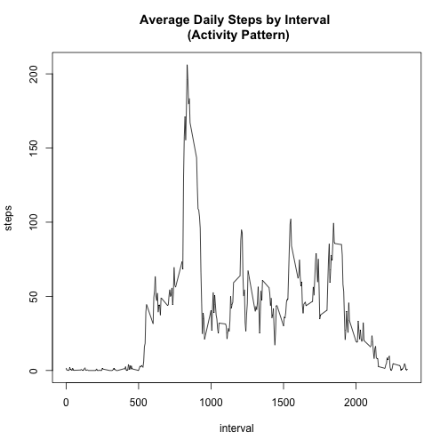

<h1>Course Project 1</h1>
<h2>Reproducible Research</h2>

*Note: All results and operations printed as rounded integers, but numbers may be stored numerically. Hence, reporting a difference of -1 in mean steps between imputing NAs and removing them, though printed rounded values appear identical.*

<h3>Loading and preprocessing the data</h3>

```r
##read csv (make sure it's in working directory)
rawData <- read.csv("activity.csv", header = TRUE, na.strings = "NA", stringsAsFactors = FALSE)

##store version of data set without NAs
activity <- rawData[complete.cases(rawData) == TRUE,]
```

<h3>1. What is the mean total number of steps taken per day?</h3>

```r
##1. Calculate the total number of steps taken per day
dailySum <- aggregate(steps ~ date, data = activity, FUN = sum)

##2. Produce histogram of total steps taken each day
hist(dailySum$steps, main = "Total Number of Steps\nTaken Each Day", ylim = c(0,30), xlab = "Steps")
```

 

```r
##3. Calculate and report the mean and median of the total number
##of steps taken per day
dailyMean <- mean(dailySum$steps)
dailyMedian <- median(dailySum$steps)

centTendRemoved <- data.frame(Type = "NAs Removed", Mean = round(dailyMean), Median = round(dailyMedian))
print(centTendRemoved)
```

```
##          Type  Mean Median
## 1 NAs Removed 10766  10765
```
The mean is **10766** steps and the median is **10765** steps with NAs removed.

<h3>2. What is the average daily activity pattern?</h3>

```r
##1. Calculate average steps by interval across all days and 
##produce time series plot
dailyPattern <- aggregate(steps ~ interval, data = activity, FUN = mean)
with(dailyPattern, plot(interval, steps, type = "l", main = "Average Daily Steps by Interval \n (Activity Pattern)"))
```

 

```r
##2. Calculate and report five-minute interval, on average across all
##days in data set, contains the maximum number of steps
maxSteps <- max(dailyPattern$steps)
print(round(dailyPattern[dailyPattern$steps == maxSteps,]))
```

```
##     interval steps
## 104      835   206
```
The five-minute interval containing the maximum number of steps is **835**, where there were an average of **206** steps.

<h3>3. Imputing missing values</h3>

```r
##1. Calculate and report NAs in raw data set
numNA <- sum(is.na(rawData$steps))
data.frame(NAs = numNA)
```

```
##    NAs
## 1 2304
```
There are **2304 NAs** in the raw data set.


```r
##2. Create an "imputed data" set where NAs in the steps column are imputed 
##to the mean of the corresponding interval recorded in the "average daily
##activity pattern" set produced above; non-missing values left alone.
imputedData <- rawData

for(i in 1:nrow(imputedData)) {
        if(is.na(imputedData$steps[i])) {
                interv <- imputedData$interval[i]
                x <- dailyPattern$interval == interv
                imputedData$steps[i] <- as.integer(round(dailyPattern[x,2]))
        }
}

##3. Plot histogram of total number of steps taken each day with imputed data
imputedSteps <- aggregate(steps ~ date, data = imputedData, FUN = sum)

par(mfcol = c(1,2))
hist(dailySum$steps, main = "Total Number of Steps\nTaken Each Day", ylim=c(0,40), xlab = "Steps")
hist(imputedSteps$steps, main = "Total Number of Steps\nTaken Each Day - IMPUTED", ylim=c(0,40), xlab = "Steps")
```

 

```r
##4. Calculate and report mean and median steps for the imputed data.
imputedMean <- mean(imputedSteps$steps)
imputedMedian <- median(imputedSteps$steps)

centTendImputed <- data.frame(Type = "NAs Imputed", Mean = round(imputedMean), Median = median(imputedMedian))

##5. Determine impact of imputing on mean and median of total steps taken
##per day
impactMean <- imputedMean - dailyMean
impactMedian <- imputedMedian - dailyMedian
impact <- data.frame(Type = "Impact of Imputing", Mean = round(impactMean), Median = round(impactMedian))

centTend <- rbind(centTendRemoved, centTendImputed, impact)
print(centTend)
```

```
##                 Type  Mean Median
## 1        NAs Removed 10766  10765
## 2        NAs Imputed 10766  10762
## 3 Impact of Imputing    -1     -3
```
The impact of imputing NAs to the mean of the corresponding interval recorded in the "average daily activity pattern" set changes the mean number of steps by **-1** and the median by **-3**. Imputing adds **86096** total steps to the data set, or an average of **37** steps per NA.

<h3>4. Are there differences in activity patterns between weekdays and weekends?</h3>

```r
##load ggplot2
library(ggplot2)

##1. Add a 'dayType' column to imputed data set
imputedData$dayType <- character(length=nrow(imputedData))

##2. Use strptime and a for loop to determine whether date represents weekday or weekend,
##and store value in same row under the created 'dayType' column.
for(i in 1:nrow(imputedData)) {
        dayOfWeek <- weekdays(strptime(imputedData$date[i], format = "%Y-%m-%d"))
        if(dayOfWeek == "Saturday" | dayOfWeek == "Sunday") {
                imputedData$dayType[i] <- "Weekend"
        } else {
                imputedData$dayType[i] <- "Weekday"
        }
}

##3. Make 'dayType' column factors and aggregate steps by that column
imputedData$dayType <- as.factor(imputedData$dayType)
imputedStepsDayType <- aggregate(steps ~ dayType + interval, data = imputedData, FUN = sum)
```

For this next section I decided to plot the difference in weekday and weekend activity patterns two different ways: as separate panels, and overlaid.

```r
##4. Plot weekday vs weekend activity patterns

##in same plot
ggplot(imputedStepsDayType, aes(interval, steps, color=dayType)) +
        geom_line() +
        ggtitle("Activity Patterns: Weekdays vs Weekends")
```

 

```r
##in different panels
qplot(interval, 
      steps, 
      data=imputedStepsDayType, 
      facets = dayType ~ ., 
      geom = "line", 
      main = "Activity Patterns: Weekdays vs Weekends", 
      ylab = "steps", 
      xlab="interval")
```

 
